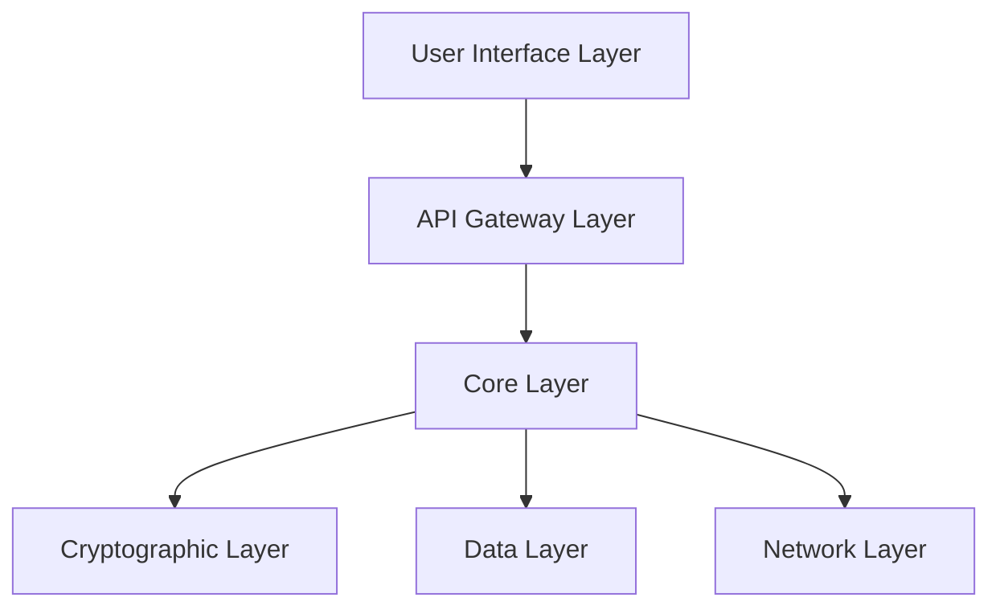
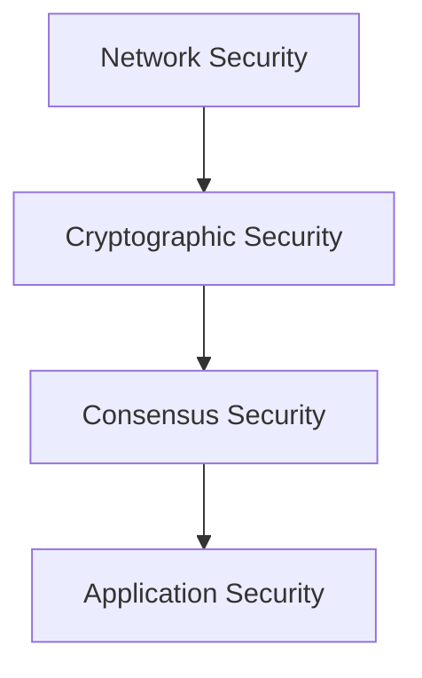
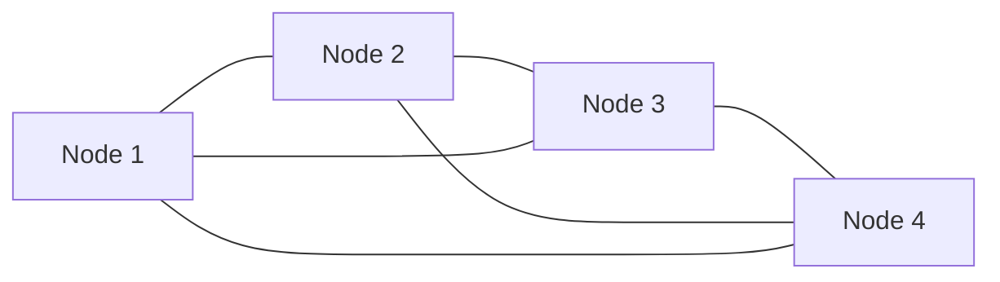
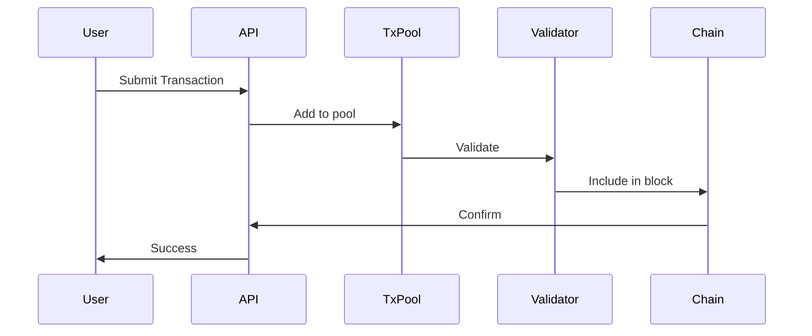
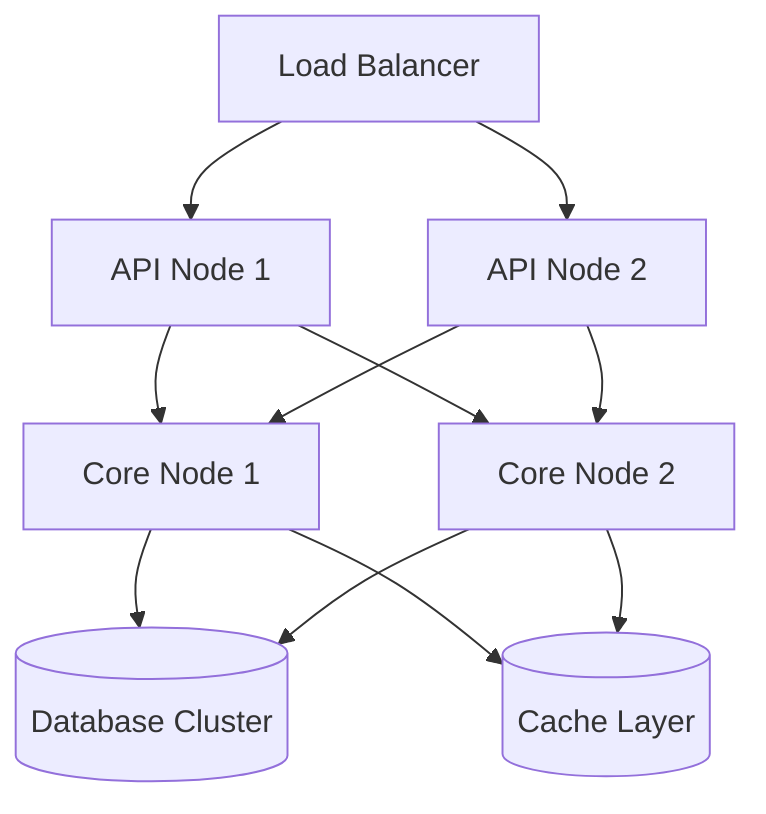

# SourceLess Blockchain Architecture Design Document v2.0

## Table of Contents
1. [System Overview](#system-overview)
2. [Core Architecture](#core-architecture)
3. [Component Details](#component-details)
4. [Security Architecture](#security-architecture)
5. [Network Architecture](#network-architecture)
6. [Data Flow & Processing](#data-flow--processing)
7. [Implementation Stack](#implementation-stack)
8. [Scalability & Performance](#scalability--performance)

## System Overview

### High-Level Architecture


### Key Components Matrix

| Component | Implementation | Primary Responsibility | Key Features |
|-----------|---------------|----------------------|--------------|
| Core Engine | Rust | Blockchain Logic | High-performance, Safe concurrency |
| Crypto Engine | C++ | Cryptographic Operations | Quantum resistance, High throughput |
| API Layer | Python | External Interface | RESTful, GraphQL, WebSocket |
| Interface | Node.js | User Interface | Real-time updates, Web3 integration |
| Storage | RocksDB | Data Persistence | High-performance KV store |
| Network | libp2p | P2P Communication | Decentralized mesh network |

## Core Architecture

### 1. StarWVM (Star Virtual Machine)
```rust
pub struct StarWVM {
    // Memory Management
    memory_manager: MemoryManager,
    // State Management
    state: StateManager,
    // Gas Metering
    gas_meter: GasMeter,
    // Execution Context
    context: ExecutionContext,
}

pub struct ExecutionContext {
    contract_address: Address,
    caller: Address,
    value: U256,
    data: Vec<u8>,
    gas_limit: U256,
}
```

### 2. GodCypher Cryptographic System
```cpp
class GodCypher {
public:
    // Quantum-resistant key generation
    KeyPair generateKeys();
    // Post-quantum signature scheme
    Signature sign(const Message& message, const PrivateKey& key);
    // Verification
    bool verify(const Message& message, const Signature& signature, const PublicKey& key);
private:
    // Lattice-based cryptography implementation
    LatticeScheme lattice_;
    // Hash-based signature scheme
    HashScheme hash_;
};
```

### 3. Ghost Wallet Implementation
```typescript
interface GhostWallet {
    // Stealth address generation
    generateStealthAddress(): Address;
    // Ring signature implementation
    createRingSignature(message: Bytes, publicKeys: Address[]): Signature;
    // Zero-knowledge proof generation
    generateZKProof(statement: Statement): Proof;
}
```

## Component Details

### 1. Core Layer (Rust)
- Memory-safe concurrent processing
- Zero-copy serialization
- Lock-free data structures
- Asynchronous I/O

```rust
pub struct BlockchainCore {
    // Chain state
    chain_state: Arc<RwLock<ChainState>>,
    // Transaction pool
    tx_pool: Arc<TransactionPool>,
    // Block producer
    block_producer: BlockProducer,
    // Consensus engine
    consensus: Box<dyn ConsensusEngine>,
}
```

### 2. Cryptographic Layer (C++)
- Quantum-resistant algorithms
- High-performance cryptography
- Hardware acceleration support
- Secure key management

```cpp
class CryptoEngine {
    // Post-quantum cryptography
    std::unique_ptr<QuantumResistantScheme> qr_scheme_;
    // Hardware security module interface
    std::unique_ptr<HSMInterface> hsm_;
    // Key management system
    KeyManagementSystem kms_;
};
```

### 3. API Layer (Python)
- FastAPI-based REST interface
- GraphQL support
- WebSocket real-time updates
- Rate limiting and security

```python
class BlockchainAPI:
    def __init__(self):
        self.core_client = CoreClient()
        self.websocket_manager = WebSocketManager()
        self.rate_limiter = RateLimiter()
        
    async def process_transaction(self, tx: Transaction) -> Hash:
        # Validate and process transaction
        return await self.core_client.submit_transaction(tx)
```

## Security Architecture

### 1. Multi-Layer Security Model


### 2. Threat Mitigation Strategies
- Network-level DDoS protection
- Sybil attack resistance
- Double-spend prevention
- Smart contract security

## Network Architecture

### 1. P2P Network Design


### 2. Node Types
- Full nodes
- Light nodes
- Archive nodes
- Validator nodes

## Data Flow & Processing

### 1. Transaction Flow


### 2. Block Processing
```rust
pub struct BlockProcessor {
    // Block validation
    validator: BlockValidator,
    // State transition
    state_transition: StateTransition,
    // Chain reorganization
    reorg_handler: ReorgHandler,
}
```

## Implementation Stack

### 1. Core Implementation
- Rust for core blockchain logic
- C++ for cryptographic operations
- Python for API and services
- Node.js for interface and tooling

### 2. Storage Layer
- RocksDB for state database
- Redis for caching
- IPFS for distributed storage

## Scalability & Performance

### 1. Performance Metrics
- Transactions per second: 100,000+
- Block time: 3 seconds
- Finality time: 12 seconds
- Storage efficiency: O(log n)

### 2. Scaling Solutions
- Horizontal sharding
- State channels
- Layer 2 solutions
- Parallel transaction processing

## Deployment Architecture

### Production Environment


## Future Roadmap

### Phase 1: Core Enhancement (Q3 2024)
- [ ] Advanced quantum resistance implementation
- [ ] Improved transaction throughput
- [ ] Enhanced privacy features

### Phase 2: Ecosystem Growth (Q4 2024)
- [ ] Cross-chain bridge implementation
- [ ] DApp platform launch
- [ ] Developer tools and SDKs

### Phase 3: Enterprise Features (Q1 2025)
- [ ] Regulatory compliance framework
- [ ] Enterprise integration APIs
- [ ] Advanced analytics and monitoring
``` 