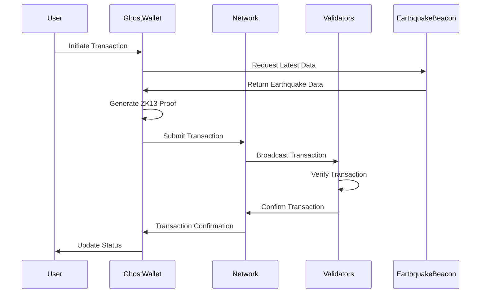
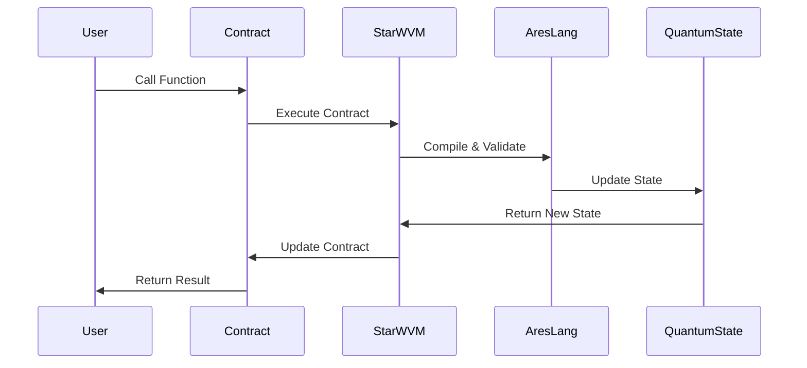

# SourceLess Blockchain Component Interactions

## 1. Transaction Flow

### 1.1 Basic Transaction Flow


### 1.2 Smart Contract Interaction


## 2. Layer Interaction

### 2.1 Three-Layer Communication
```rust
impl LayerInteraction {
    // Base Layer to Protocol Layer
    fn base_to_protocol(
        block: Block,
        quantum_state: QuantumState
    ) -> ProtocolMessage {
        ProtocolMessage {
            block_data: block,
            quantum_proof: generate_quantum_proof(block),
            state_update: quantum_state
        }
    }

    // Protocol Layer to Application Layer
    fn protocol_to_application(
        contract_result: ContractResult,
        zk_proof: ZK13Proof
    ) -> ApplicationMessage {
        ApplicationMessage {
            result: contract_result,
            proof: zk_proof,
            status: verify_execution(contract_result)
        }
    }
}
```

### 2.2 Cross-Layer Validation
```rust
impl CrossLayerValidator {
    // Validate interaction between layers
    fn validate_interaction(
        base_data: &BaseLayerData,
        protocol_data: &ProtocolLayerData,
        app_data: &ApplicationLayerData
    ) -> Result<bool> {
        // 1. Verify quantum state consistency
        self.verify_quantum_state(
            base_data.quantum_state,
            protocol_data.quantum_state
        )?;

        // 2. Validate ZK proofs
        self.verify_zk_proofs(
            protocol_data.zk_proofs,
            app_data.transaction_proofs
        )?;

        // 3. Check earthquake data consistency
        self.verify_earthquake_data(
            base_data.earthquake_data,
            protocol_data.last_quake
        )?;

        Ok(true)
    }
}
```

## 3. Smart Contract Execution

### 3.1 AresLang Contract Flow
```rust
impl ContractExecution {
    // Execute AresLang contract
    fn execute_contract(
        contract: &Contract,
        input: &[u8],
        context: &ExecutionContext
    ) -> Result<Output> {
        // 1. Compile contract
        let bytecode = self.compiler.compile(contract)?;

        // 2. Setup execution environment
        let env = self.setup_environment(context)?;

        // 3. Execute with quantum protection
        let (result, new_state) = self.vm.execute_quantum_safe(
            bytecode,
            input,
            env
        )?;

        // 4. Generate execution proof
        let proof = self.generate_execution_proof(
            result,
            new_state
        )?;

        Ok(Output {
            result,
            proof,
            new_state
        })
    }
}
```

### 3.2 State Management
```rust
impl StateManager {
    // Update contract state
    fn update_state(
        &mut self,
        contract: &Contract,
        new_state: &State,
        proof: &ZK13Proof
    ) -> Result<()> {
        // 1. Verify state transition
        self.verify_state_transition(
            contract.current_state,
            new_state
        )?;

        // 2. Validate quantum proof
        self.verify_quantum_proof(proof)?;

        // 3. Update state
        self.commit_state_update(
            contract.id,
            new_state,
            proof
        )
    }
}
```

## 4. Cryptographic Operations

### 4.1 ZK13 Proof Generation
```rust
impl ZK13ProofGenerator {
    // Generate ZK proof for transaction
    fn generate_proof(
        &self,
        tx: &Transaction,
        earthquake_data: &EarthquakeData
    ) -> Result<ZK13Proof> {
        // 1. Create nullifier
        let nullifier = self.create_nullifier(tx)?;

        // 2. Generate commitment
        let commitment = self.generate_commitment(
            tx,
            earthquake_data
        )?;

        // 3. Create Merkle proof
        let merkle_proof = self.create_merkle_proof(
            commitment,
            self.state_tree
        )?;

        // 4. Combine proofs
        Ok(ZK13Proof {
            nullifier,
            commitment,
            merkle_proof,
            earthquake_data: earthquake_data.clone()
        })
    }
}
```

### 4.2 Quantum State Management
```rust
impl QuantumStateManager {
    // Update quantum state
    fn update_state(
        &mut self,
        earthquake_data: &EarthquakeData
    ) -> Result<QuantumState> {
        // 1. Verify earthquake data
        self.verify_earthquake_data(earthquake_data)?;

        // 2. Generate new quantum seed
        let new_seed = self.generate_quantum_seed(
            earthquake_data
        )?;

        // 3. Update rotation matrix
        let new_rotation = self.calculate_rotation(
            earthquake_data.timestamp
        )?;

        // 4. Create new state
        Ok(QuantumState {
            seed: new_seed,
            rotation: new_rotation,
            last_update: earthquake_data.timestamp
        })
    }
}
```

## 5. Network Protocol

### 5.1 P2P Communication
```rust
impl P2PNetwork {
    // Broadcast transaction
    fn broadcast_transaction(
        &self,
        tx: Transaction,
        proof: ZK13Proof
    ) -> Result<()> {
        // 1. Prepare message
        let message = NetworkMessage::new(
            MessageType::Transaction,
            tx,
            proof
        );

        // 2. Sign message
        let signature = self.sign_message(&message)?;

        // 3. Broadcast to peers
        self.broadcast_to_peers(message, signature)
    }
}
```

### 5.2 Consensus Protocol
```rust
impl ConsensusProtocol {
    // Process new block
    fn process_block(
        &mut self,
        block: Block,
        proof: ExistenceProof
    ) -> Result<()> {
        // 1. Verify block
        self.verify_block(&block)?;

        // 2. Validate proof of existence
        self.validate_existence_proof(
            &block,
            &proof
        )?;

        // 3. Update state
        self.update_chain_state(block, proof)?;

        // 4. Notify peers
        self.notify_peers_new_block(block.hash())
    }
}
```

## 6. User Interface Integration

### 6.1 API Layer
```typescript
class APILayer {
    // Process user transaction
    async processTransaction(
        tx: TransactionRequest,
        wallet: GhostWallet
    ): Promise<TransactionResult> {
        // 1. Generate proofs
        const zkProof = await wallet.generateZK13Proof(tx);
        const quantumProof = await wallet.generateQuantumProof(tx);

        // 2. Submit transaction
        const result = await this.submitTransaction(
            tx,
            zkProof,
            quantumProof
        );

        // 3. Wait for confirmation
        return this.waitForConfirmation(result.txHash);
    }
}
```

### 6.2 Event System
```typescript
class EventSystem {
    // Handle blockchain events
    async handleEvent(
        event: BlockchainEvent
    ): Promise<void> {
        switch (event.type) {
            case 'NewBlock':
                await this.processNewBlock(event.data);
                break;
            case 'StateUpdate':
                await this.updateState(event.data);
                break;
            case 'QuakeUpdate':
                await this.processQuakeData(event.data);
                break;
        }
    }
}
```

## 7. Security Interactions

### 7.1 Multi-layer Security
```rust
impl SecurityManager {
    // Validate cross-layer security
    fn validate_security(
        &self,
        base_security: &BaseSecurity,
        protocol_security: &ProtocolSecurity,
        app_security: &ApplicationSecurity
    ) -> Result<()> {
        // 1. Verify quantum resistance
        self.verify_quantum_security(
            base_security.quantum_state,
            protocol_security.quantum_proofs
        )?;

        // 2. Validate privacy measures
        self.verify_privacy_measures(
            protocol_security.zk_proofs,
            app_security.privacy_settings
        )?;

        // 3. Check earthquake data integrity
        self.verify_earthquake_integrity(
            base_security.earthquake_data,
            protocol_security.quake_proofs
        )
    }
}
```

### 7.2 Audit System
```rust
impl AuditSystem {
    // Record security event
    fn record_event(
        &mut self,
        event: SecurityEvent,
        proofs: Vec<SecurityProof>
    ) -> Result<()> {
        // 1. Verify event data
        self.verify_event_data(&event)?;

        // 2. Generate audit proof
        let audit_proof = self.generate_audit_proof(
            event,
            &proofs
        )?;

        // 3. Store in audit log
        self.store_audit_record(
            event,
            audit_proof,
            proofs
        )
    }
}
```

This document outlines the key interactions between the major components of the SourceLess Blockchain system. Each component is designed to work seamlessly with others while maintaining clear boundaries and interfaces. 